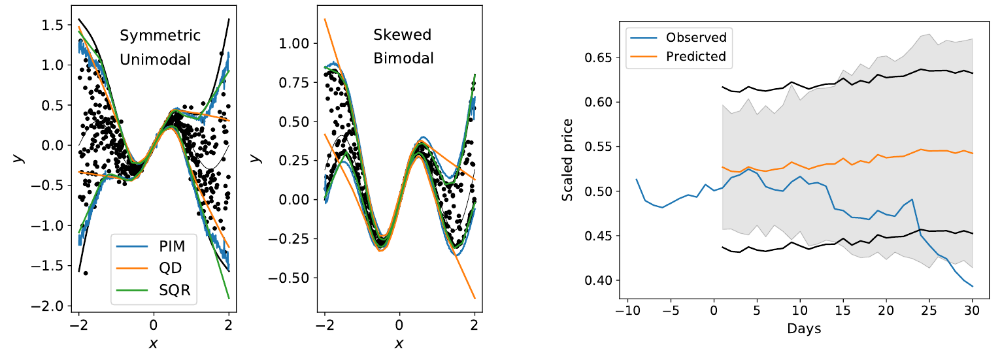
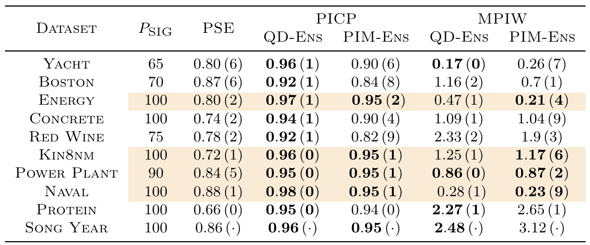
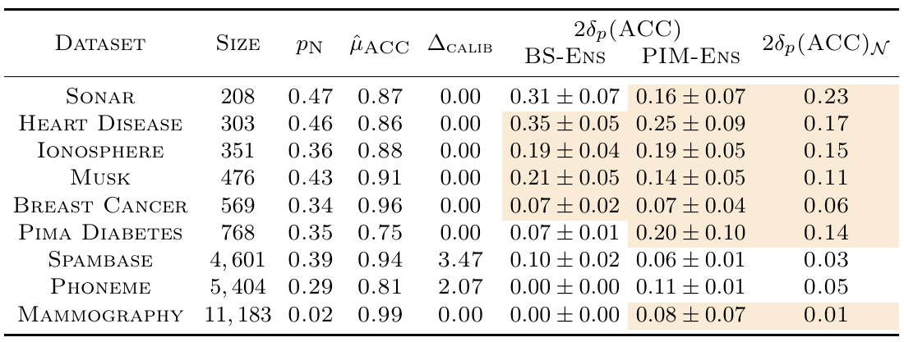

# PIM
This repository is the official implementation of the paper [Can a single neuron learn predictive uncertainty?](https://arxiv.org/abs/2106.03702) accepted for publication in the International Journal of Uncertainty, Fuzziness, and Knowledge-Based Systems.

<p align="center">
  
</p> 

PIM is a consistent quantile estimator that can be used to estimate prediction/confidence intervals in regression/classification problems using gradient descend. What makes it appealing is that, for problems with IID samples, the *single* weight that it learns is also the value of the quantity that it aims to estimate. Therefore, it is a non-parametric quantile estimator, giving comparable or better estimates than ranking the order statistic. 

For problems with heteroskedasticity, it can be easily adapted to estimate prediction intervals, such as in the toy example in the figure above (left), or the shaded area in a real-world example of a stok price prediction (right); in both cases having comparable or better coverage than popular baselines at a lesser cost. 
> To use it, train your own predictive model. Afterwards, PIM will measure (learn) its uncertainty from your predictions on the validation set. In most cases, this turns out to be a good estimate of the uncertainty on the test set.

# Content:
To reproduce the content of the paper, the code is organized as follows:
```
├── data                (Datasets and metadata for regression, classification and time series)
├── clean_cls_data.py   (For data cleaning of classification datasets)
├── calib_cls.py        (For calibrating classifiers)
├── cls_benchmarks.py   (To train classification model on given dataset)
├── hetero_var.py       (To get PSE and P_sig in Table 2)
├── hp_optim_cwc.py     (For hyperparameter optimization with cwc)
├── hp_optim.py         (For hyperparameter optimization without cwc)
├── pim_vs_qr.py        (To plot Fig. 2)
├── pim_vs_ranking.py   (To plot Fig. 1)
├── pim.py              (PIM models)
├── plot_ts.py          (To plot Fig. 3) 
├── reg_benchmarks.py   (To train regression model on given dataset) 
├── run_cls.py          (To train on all classification datasets)
├── run_reg.py          (To train on all regression datasets)
└── sqr.py              (Simultaneous Quantiles Regression)
```

# Requirements
First clone this repository:
```
git clone https://github.com/DLR-MI/pim.git
cd pim
```
and install suitable dependencies:
```
pip install -r requirements.txt
```

# Datasets
The datasets used for benchmarking regression and classification experiments are all public, and can be downloaded from the [UCI Machine Learning Repository](https://archive.ics.uci.edu/ml/datasets/adult). We provide them here in the data folder. For the classification datasets, we perform data preprocessing by running
```
python clean_cls_data.py
``` 

# Train / Test

You can learn more about the usage of PIM in both regression and classification problems by reproducing the results of the paper. For the regression benchmarks,
the best models need to be found for each dataset by running
```
python hp_optim.py --project PROJECT --dataset DATASET --verbose 1
```
This will store the best model hyperparamters in `./PROJECT`, which defaults to `./models`. Afterwards, run the benchmarking experiments using
```
python run_reg.py --project PROJECT --train
```
This will train PIM for each dataset (invoking `reg_benchmarks.py`) and store the results in `./PROJECT`. To display such results, run the command above without the `--train` flag.

Similarly, for the classification benchmarking experiments just run
```
python run_cls.py --results_dir ./data/classification/results --train
```
aftwer which the display of results follows by running again without the `--train` flag.

### Train on your own models
To train PIM on a regression problem, you just need: 
```python
import numpy
import pim
from tensorflow.keras.optimizers import Adam
from tensorflow.keras.callbacks import EarlyStopping

x_val, y_val = get_your_val_data()
y_pred_val = get_your_model_preds_on_val()

# Error distribution on validation set
err_val = y_val - y_pred_val

# Train PIM
umodel = pim.PredictionInterval(0.95, err='sym')
umodel.compile(loss=umodel.pim.loss, optimizer=Adam(lr=0.005))
_ = umodel.fit(err_val, err_val, 
              epochs=1000, 
              batch_size=x_val.shape[0], 
              callbacks=[EarlyStopping(monitor='loss', mode='min')])
# Mean prediction interval width
mpiw_val = sum(umodel.pim.radius)
# Prediction interval coverage probability
picp_val = np.mean(umodel.pim.picp(err_val).numpy())
```
It will work better if the error distribution is homoskedastic, but still gives reasonable results for heteroskedastic problems, as discussed in the paper.

# Results
For regression datasets which are practically homoskedastic, PIM gets better estimates of prediction intervals than the popular [Quality Driven (QD)](https://github.com/TeaPearce/Deep_Learning_Prediction_Intervals) prediction intervals, as shown by shaded rows in the table below, and at a lesser cost in the number of model parameters.

<p align="center">
  
</p>

For classification datasets, PIM gets better estimates of confidence intervals for the accuracy of the predictions than the popular Bootstrap (BS) method, as shown in the table below (compare with the binomial estimate in the last column).

<p align="center">
  
</p>

# Citation
```
@misc{Dua:2019 ,
      author = "Dua, Dheeru and Graff, Casey",
      year = "2017",
      title = "{UCI} Machine Learning Repository",
      url = "http://archive.ics.uci.edu/ml",
      institution = "University of California, Irvine, School of Information and Computer Sciences" }
```

```
@misc{solanocarrillo2023single,
      title={Can a single neuron learn predictive uncertainty?}, 
      author={Edgardo Solano-Carrillo},
      year={2023},
      eprint={2106.03702},
      archivePrefix={arXiv},
      primaryClass={stat.ML}
}
```